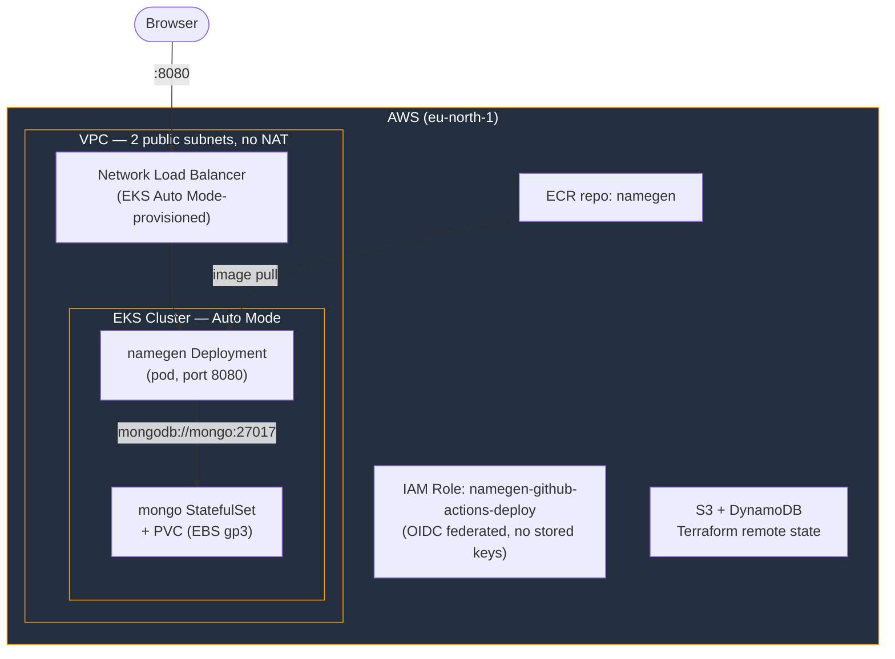
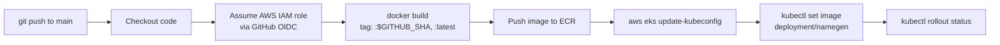

# random-name-gen-app

A demonstration app (Express API + MongoDB, jQuery/Bootstrap front end) for generating and persisting random names via `@faker-js/faker`. Originally forked from [`redhat-developer-demos/namegen`](https://github.com/reselbob/random-name-gen-app) (kept as the `upstream` remote).

The app itself is a vehicle for the real project: **deploying it to AWS EKS (Auto Mode) with a full Terraform + GitHub Actions CI/CD pipeline.** This was a one-time practice deploy — built, demoed, screenshotted (see `screenshots/`), and fully torn down afterward to avoid ongoing AWS cost. See `docs/PLAN.md` for the full decision log if you have access to it (gitignored, local-only).

## Architecture



- **Node.js app** (`server.js`) serves the static front end (`public/index.html`) and the `/api/*` routes from the same process.
- **MongoDB** runs as a single-replica `StatefulSet` with an EBS-backed `PersistentVolumeClaim` (see `k8s/mongo.yaml` — Auto Mode needs its own `StorageClass`, the default `gp2` in-tree class isn't usable on Auto Mode nodes).
- **Exposure** is a Kubernetes `Service` of type `LoadBalancer`, using EKS Auto Mode's built-in NLB provisioning (no separate AWS Load Balancer Controller installed).
- **GitHub Actions** authenticates to AWS via an OIDC-federated IAM role — no long-lived AWS access keys stored in GitHub.

## CI/CD Pipeline



Defined in `.github/workflows/deploy.yml`. A separate `.github/workflows/test.yml` runs the Mocha test suite against a `mongo:3.6` service container on every push, independent of deploy.

## Local Development

**Prerequisites**: Node.js, a running MongoDB instance (local or remote).

1. Clone the repo and `npm install`.
2. Create a `.env` file in the project root:
   ```
   MONGODB_URL=<connection_string_to_your_mongodb_server>
   ```
   Optional: `SERVER_PORT=<port>` (defaults to `8080`), `DB_NAME=<name>` (defaults to `namegen`).
3. Start the server: `node server.js`
4. Open `http://localhost:8080/` (or whatever `SERVER_PORT` you set).

**Tests**: `npm test` is a placeholder script — run Mocha directly instead:
```
npx mocha tests/*.js
```

## AWS Deployment

Redeploying this from scratch requires: an AWS account, the AWS CLI, Terraform, `kubectl`, and Docker.

### 1. Bootstrap the Terraform state backend

Terraform's own state has to live somewhere before `terraform init` can use it as a backend, so this one step is created manually (not by Terraform):

```bash
aws s3api create-bucket --bucket <unique-bucket-name> --region <region> \
  --create-bucket-configuration LocationConstraint=<region>
aws s3api put-bucket-versioning --bucket <unique-bucket-name> \
  --versioning-configuration Status=Enabled

aws dynamodb create-table --table-name <lock-table-name> \
  --attribute-definitions AttributeName=LockID,AttributeType=S \
  --key-schema AttributeName=LockID,KeyType=HASH \
  --billing-mode PAY_PER_REQUEST

aws iam create-user --user-name <terraform-iam-user>
aws iam attach-user-policy --user-name <terraform-iam-user> \
  --policy-arn arn:aws:iam::aws:policy/AdministratorAccess   # scope down for anything long-lived
aws iam create-access-key --user-name <terraform-iam-user>   # configure these as your active AWS credentials
```

Update the bucket/table names in `terraform/backend.tf` to match.

### 2. Provision the infrastructure

```bash
cd terraform
terraform init
terraform apply
```

This creates: the VPC, the EKS Auto Mode cluster, the ECR repo, and the OIDC provider + IAM role GitHub Actions will assume.

```bash
aws eks update-kubeconfig --name namegen --region <region>
kubectl get nodes   # Auto Mode provisions a node on-demand once something needs scheduling
```

### 3. First image build + manual deploy

```bash
aws ecr get-login-password --region <region> | docker login --username AWS --password-stdin <ecr-repo-url>
docker build -t <ecr-repo-url>:latest .
docker push <ecr-repo-url>:latest

kubectl apply -f k8s/mongo.yaml
kubectl apply -f k8s/secret.yaml
kubectl apply -f k8s/app.yaml
```

Get the app's public URL:
```bash
kubectl get svc namegen   # EXTERNAL-IP column is the NLB DNS name; app listens on :8080
```

### 4. Enable CI/CD

Push to `main` — `.github/workflows/deploy.yml` picks up from here automatically (build → push to ECR → roll out to EKS). No GitHub secrets are needed; the role ARN is embedded in the workflow and trust is scoped to this exact repo via OIDC.

## Teardown

Everything provisioned above is destroyable. `teardown.sh` (repo root) automates it in the required order — deleting the state backend or the IAM user too early will strand resources or lock you out of destroying them:

```bash
./teardown.sh   # prompts for confirmation before doing anything
```

Order: delete the `LoadBalancer` Service (deprovisions the NLB) → `terraform destroy` (cluster, VPC, ECR, OIDC role) → empty + delete the S3 state bucket → delete the DynamoDB lock table → delete the bootstrap IAM user's access key and the user itself.

After running it, spot-check the AWS Console (EKS, EC2/ELB, ECR, S3, DynamoDB, IAM, and Billing/Cost Explorer) to confirm nothing billable is left.

## Repo Layout

- `server.js`, `data/`, `public/` — the app itself
- `Dockerfile` — container build (`node:24-alpine`, non-root)
- `terraform/` — all AWS infrastructure (VPC, EKS, ECR, OIDC/IAM, remote state backend config)
- `k8s/` — Kubernetes manifests (app `Deployment`/`Service`, Mongo `StatefulSet`/`PVC`, `Secret`)
- `.github/workflows/` — CI (`test.yml`) and CD (`deploy.yml`)
- `screenshots/` — app UI states, EKS/ECR/NLB console views, and pipeline run logs
- `teardown.sh` — Phase 5 automation (see above)
